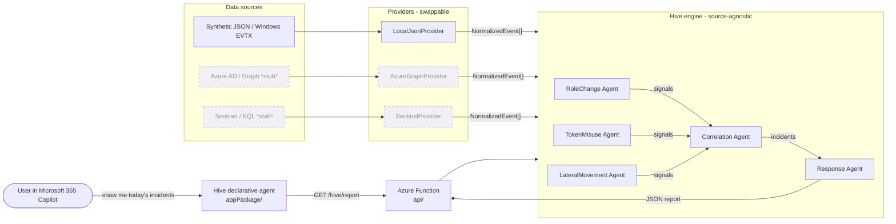
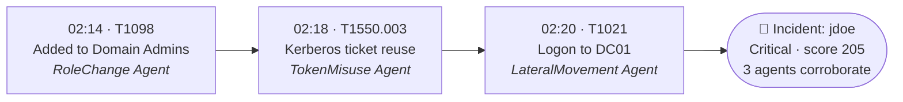

<p align="center">
  
</p>

<p align="center">
  <b>Microsoft Agents League · Enterprise Agents (Microsoft 365 Copilot)</b><br>
  <i>Catches privilege escalation before compromise · MITRE ATT&CK mapped · advisory-only</i>
</p>

# Hive — Privilege Escalation Watchdog

A focused, multi-agent watchdog that detects **privilege-escalation precursors**
across hybrid identity environments (local AD today, Azure AD / Sentinel later).
Microsoft 365 tells you when an account is *compromised*; Hive flags the quieter
steps **before** full compromise — an unusual role grant, a reused Kerberos
ticket, a low-privilege account suddenly touching a domain controller — and
**correlates** them into a single incident.

> Scope is deliberately contained to the *Privilege Escalation Watchdog* problem,
> not "all of cybersecurity." Everything else (dark-web intel, phishing sims) is
> out of scope by design.

## Why it's enterprise-ready (the architecture pitch)

Hive is built around one rule: **agents depend on a normalized data contract,
never on a data source.** This is what makes it a drop-in complement to
Microsoft 365 security rather than a throwaway demo.



> Providers are the **only** code that knows a data source's format. Everything
> right of `NormalizedEvent[]` is source-agnostic — that's why Azure AD / Sentinel
> can be added later without touching agent logic.

- **Abstracted interface** — providers are the only code that knows a source's
  format. They emit `NormalizedEvent` objects ([src/Core/EventModel.ps1](src/Core/EventModel.ps1)).
- **Endpoint stubs** — [AzureGraphProvider.ps1](src/Providers/AzureGraphProvider.ps1)
  and [SentinelProvider.ps1](src/Providers/SentinelProvider.ps1) are ready to
  implement; they don't change agent logic.
- **Agent independence** — each agent reads `NormalizedEvent` and emits
  `HiveSignal`. It can't tell whether data came from a file or Microsoft Graph.
- **Configuration layer** — [config/settings.json](config/settings.json) toggles
  `use_local_logs` / `use_azure_graph` / `use_sentinel`.

## The agents

| Agent | Looks for | Rules |
|-------|-----------|-------|
| **RoleChangeAgent** | additions to privileged groups (Domain Admins, etc.), worse if off-hours or by a service account | RC-001 |
| **TokenMisuseAgent** | Kerberos ticket used from a host different from where it was issued (pass-the-ticket) | TM-001 |
| **LateralMovementAgent** | sensitive host accessed by a non-baseline account; failed-logon spray | LM-001, LM-002 |
| **CorrelationAgent** | groups signals by entity, scores them, **bonus when ≥2 agents agree** | — |
| **ResponseAgent** | maps escalated incidents to containment steps (advisory-only in the demo) | — |

A single rule rarely escalates on its own — **correlation across agents** is what
turns three weak signals into one Critical incident. That's the core idea.

Every signal is mapped to a **MITRE ATT&CK** technique, and each escalated
incident is reconstructed as a time-ordered **attack chain** so an analyst sees
*how* the escalation unfolded:

```
jdoe  (Critical, score 205)   Privilege Escalation -> Lateral Movement
  02:14  T1098      Added to Domain Admins (off-hours, by service account)
  02:18  T1550.003  Kerberos ticket reused from a different host (pass-the-ticket)
  02:20  T1021      Logged on to DC01 (sensitive host, non-baseline account)
```



## How it maps to the judging criteria

| Criterion | How Hive addresses it |
|---|---|
| **Accuracy & Relevance** | Detects real escalation TTPs (4728/4768/4769/4624 events); benign changes (Marketing group, daytime logons) correctly do **not** escalate — low false positives. |
| **Reasoning & Multi-step** | Per-user correlation + time-ordered ATT&CK attack chain turns isolated alerts into one explained incident. |
| **Creativity & Originality** | A watchdog that catches escalation *precursors* and lives inside M365 Copilot — complements, not duplicates, built-in detection. |
| **User Experience** | Conversational Copilot agent + a self-contained HTML dashboard with severity badges and a kill-chain timeline. |
| **Reliability & Safety** | Advisory-only (never auto-disables); 14 Pester tests prove deterministic behavior; agent instructed never to claim it executed containment. |

## Run it

```powershell
cd C:\Users\taylo\Hive
.\Invoke-Hive.ps1
```

Expected: ~5 signals, a **Critical** escalated incident for `jdoe` (3 agents),
a low "watch" incident for `guest`, and a recommended-response block.
The attack scenarios are documented in [data/playbooks/scenarios.md](data/playbooks/scenarios.md).

If PowerShell blocks the script:
```powershell
powershell -ExecutionPolicy Bypass -File .\Invoke-Hive.ps1
```

Generate a standalone **HTML dashboard** (great for the demo video):
```powershell
.\Invoke-Hive.ps1 -Html      # writes report.html and opens it
```

Run the **test suite** (proves the engine is deterministic):
```powershell
.\tests\Invoke-Tests.ps1      # installs Pester if needed, then runs 14 tests
```

## Microsoft 365 Copilot integration (Enterprise Agents category)

Hive ships as a **declarative agent for Microsoft 365 Copilot**. Users chat with
Hive inside Copilot; the agent calls an API action that runs the engine and
returns incidents as JSON. The PowerShell engine is unchanged — it's the backend.

- **Agent package** — [appPackage/](appPackage/): `declarativeAgent.json`
  (persona, conversation starters, safety instructions), `ai-plugin.json` +
  `hive-openapi.yaml` (the `getHiveReport` action), `manifest.json` (M365 app).
- **API backend** — [api/](api/): an Azure Functions HTTP endpoint
  (`GET /api/hive/report`) that runs the engine via
  [Get-HiveReport](src/Core/HiveReport.ps1).

### Deploy / sideload

1. **Host the API.** Run locally with `func start` in `api/` (needs Azure
   Functions Core Tools) or deploy to an Azure Function App. Note the base URL.
2. **Point the action at it.** Replace `YOUR-FUNCTION-APP.azurewebsites.net` in
   `appPackage/hive-openapi.yaml` and `appPackage/manifest.json` with your URL.
3. **Package + sideload.** Zip the contents of `appPackage/` and upload via the
   Microsoft 365 Agents Toolkit (VS Code) or the Teams/M365 admin "Upload custom
   app". Open Microsoft 365 Copilot, pick **Hive**, and try a conversation starter.

> Prefer no-code? Recreate the same agent in **Copilot Studio**, add `getHiveReport`
> as a custom connector/action pointing at the same Azure Function, and publish.

## Project layout

```
Hive/
  Invoke-Hive.ps1            CLI entry point + console report
  config/settings.json       data-source toggles + correlation thresholds
  data/
    sample-ad-logs.json      synthetic Windows/AD events (the attack chain)
    playbooks/scenarios.md   what each scenario demonstrates
  src/
    Core/EventModel.ps1      NormalizedEvent + HiveSignal contracts
    Core/HiveCore.ps1        provider dispatch + orchestration
    Core/HiveReport.ps1      JSON report shaped for the Copilot action
    Core/HiveHtmlReport.ps1  standalone HTML dashboard renderer
    Providers/               LocalJson (real) + AzureGraph/Sentinel (stubs)
    Agents/                  the five agents
  tests/                     Pester suite (14 tests) + runner
  appPackage/                Microsoft 365 Copilot declarative agent
    declarativeAgent.json    persona, starters, safety instructions
    ai-plugin.json           API plugin (getHiveReport action)
    hive-openapi.yaml        OpenAPI spec for the action
    manifest.json            M365 app manifest
    color.png / outline.png  app icons
  api/                       Azure Functions backend (serves the engine as JSON)
    HiveReport/              GET /api/hive/report
```

## Extending toward Azure (no agent rewrites)

1. Implement `Invoke-AzureGraphProvider` to call `/auditLogs/directoryAudits`
   and `/signIns`, mapping each entry to a `NormalizedEvent`.
2. Set `use_azure_graph = true` (and `use_local_logs = false`) in settings.json.
3. Run the exact same agents. Done.

The same pattern applies to Sentinel via KQL.

## Credits

Hive's concept, architecture, and detection design were developed with the full
assistance of **Microsoft Copilot**, which helped shape the multi-agent watchdog
approach, the provider-abstraction strategy for future Azure integration, and the
attack-scenario playbooks used in this demo.
