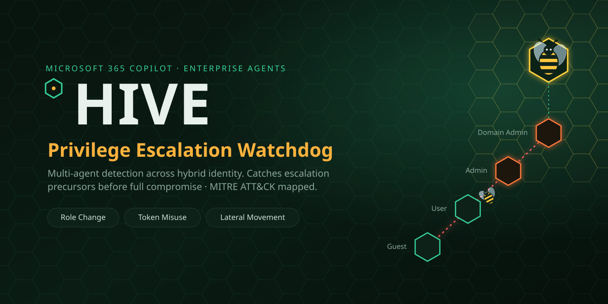

# Microsoft Agents League — Submission

<p align="center"></p>

## Entry

| Field | Detail |
|---|---|
| **Project** | Hive — Privilege Escalation Watchdog |
| **Challenge** | **Enterprise Agents** (business-ready agents for Microsoft 365 Copilot) |
| **Required technology** | Microsoft 365 Copilot (declarative agent + API action) |
| **Repository** | https://github.com/YOUR-USERNAME/hive |
| **Demo video** | https://youtu.be/YOUR-VIDEO _(≤ 5 min)_ |

## Problem

Microsoft 365 security is excellent at telling you when an account is **already
compromised**. The quiet steps *before* that — a user suddenly added to Domain
Admins, a Kerberos ticket reused from the wrong host, a low-privilege account
logging into a domain controller — often each look minor on their own and slip
between alerts. Attackers escalate privilege in exactly this gap.

## Solution

Hive is a multi-agent watchdog that lives **inside Microsoft 365 Copilot**. An
analyst asks Copilot *"show me today's privilege-escalation incidents"* and Hive:

1. Ingests identity/AD events through a **swappable provider** (synthetic logs
   today; Azure AD / Sentinel stubbed for later — no agent changes needed).
2. Runs three detection agents — **Role Change, Token Misuse, Lateral Movement**.
3. **Correlates** their signals per user, maps each to **MITRE ATT&CK**, and
   reconstructs a time-ordered **attack chain**.
4. Recommends containment via a **Response agent** — *advisory-only*, never
   auto-executed.

The core idea: a single rule rarely justifies escalation; **correlation across
agents** turns three weak signals into one Critical, explainable incident.

## Technologies

- **Microsoft 365 Copilot** declarative agent (`appPackage/`) with a
  `getHiveReport` API action.
- **Azure Functions** (PowerShell) backend serving the engine as JSON (`api/`).
- **PowerShell** detection engine with a provider-abstraction architecture
  (`src/`), built for **Azure AD / Microsoft Graph / Sentinel** extension.
- **MITRE ATT&CK** technique mapping; **Pester** test suite (14 tests).

## How to run

```powershell
.\Invoke-Hive.ps1          # console detection report
.\Invoke-Hive.ps1 -Html    # + standalone HTML dashboard
.\tests\Invoke-Tests.ps1   # 14 Pester tests, all green
```
See [README.md](README.md) for the M365 Copilot deploy/sideload steps.

## Judging-criteria alignment

| Criterion | Where Hive delivers |
|---|---|
| Accuracy & Relevance (20%) | Real escalation TTPs; benign changes correctly do not escalate (low false positives). |
| Reasoning & Multi-step (20%) | Per-user correlation + time-ordered ATT&CK attack chain. |
| Creativity & Originality (15%) | Catches escalation *precursors*, complements (not duplicates) M365 detection. |
| User Experience (15%) | Conversational Copilot agent + polished HTML dashboard. |
| Reliability & Safety (20%) | Advisory-only; 14 deterministic tests; agent instructed never to claim it executed containment. |

## Safety statement

Hive is **advisory-only**. It never disables accounts, revokes tokens, or takes
any containment action automatically; every recommendation requires human
approval. Detection runs on **simulated enterprise logs** in this demo, with a
documented path to live Azure AD / Sentinel data.

## Team

| Name | Microsoft Learn username | Role |
|---|---|---|
| _Your name_ | _your-mslearn-id_ | _e.g. Lead / Architecture_ |
